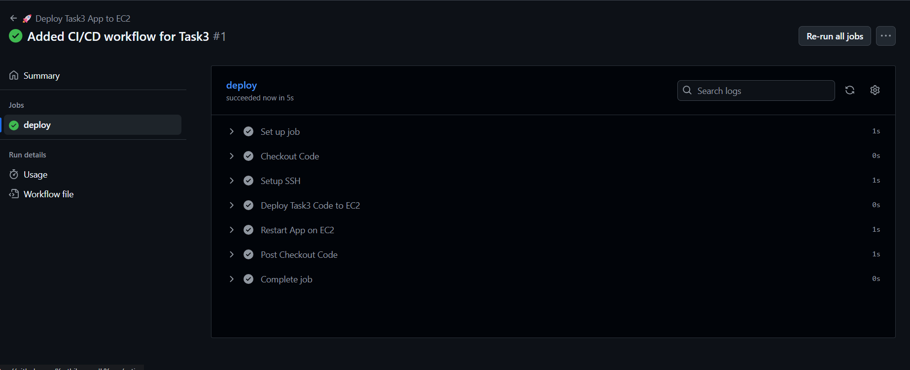
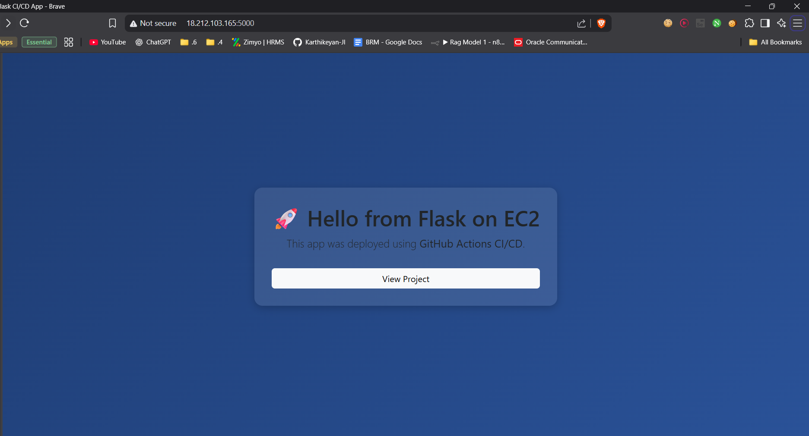

# 🚀 Flask CI/CD App on Amazon Linux EC2

This project is a **Flask web application** deployed automatically to an **Amazon Linux EC2 instance** using **GitHub Actions CI/CD**.

The app serves a styled homepage (Bootstrap + custom CSS) and demonstrates a simple continuous deployment pipeline.

---

## 📂 Project Structure

```
.
├── app.py              # Flask application
├── requirements.txt    # Python dependencies
├── templates/
│   └── index.html      # Homepage template (Bootstrap styled)
└── .github/
    └── workflows/
        └── deploy.yml  # GitHub Actions deployment pipeline
```

---

## ⚙️ Features

- ✅ Flask app with a styled homepage (Bootstrap + CSS)  
- ✅ CI/CD with GitHub Actions  
- ✅ Automatic deployment to **Amazon Linux EC2**  
- ✅ Runs on **port 5000** (configurable)  
- ✅ Health check ready for monitoring  

---

## 🚀 Deployment Pipeline (GitHub Actions)

The deployment process:

1. **Trigger** → On push to the `main` branch.  
2. **Checkout** → Pulls the latest code.  
3. **SSH Setup** → Connects to EC2 using GitHub Secrets.  
4. **Rsync Deploy** → Syncs code to `/home/ec2-user/app/`.  
5. **Restart Service** → Installs dependencies and restarts Flask app.  

### 🔑 Required GitHub Secrets

- `EC2_PUBLIC_IP` → Your EC2 instance public IP  
- `SSH_USERNAME` → Usually `ec2-user`  
- `SSH_PRIVATE_KEY` → Your `.pem` private key  

---

## 🖥️ Running Locally

1. Clone repo:
   ```bash
   git clone https://github.com/your-username/your-repo.git
   cd your-repo
   ```

2. Install dependencies:
   ```bash
   pip install -r requirements.txt
   ```

3. Run Flask app:
   ```bash
   python app.py
   ```

4. Visit → [http://localhost:5000](http://localhost:5000)

---

## 🌐 Running on EC2

Once deployed successfully, open:

```
http://<EC2_PUBLIC_IP>:5000
```

If you configured port 80 instead, just use:

```
http://<EC2_PUBLIC_IP>/
```

---

## 🔍 Example

**Homepage Preview includes:**

- Gradient background  
- Glass-style card with title & button

---
## Screenshot

Deployment Screenshot



Output Screenshot
