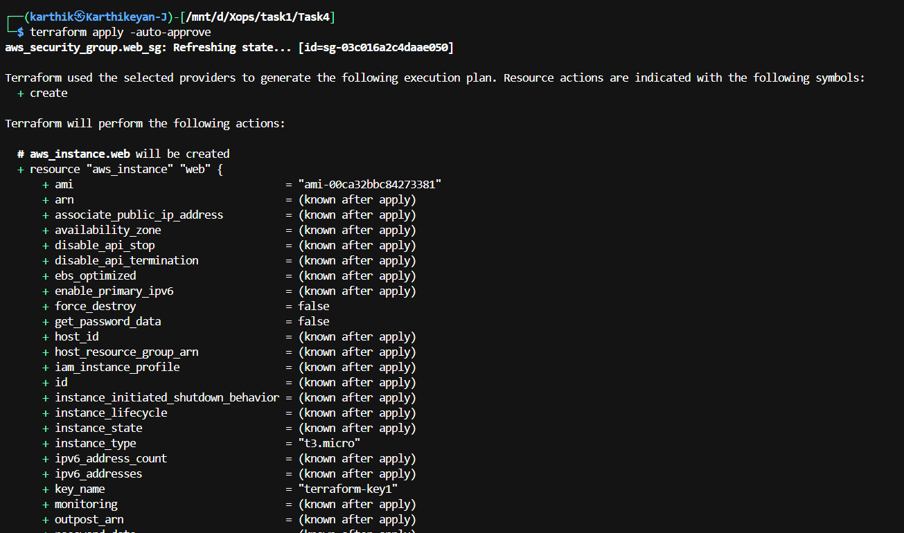
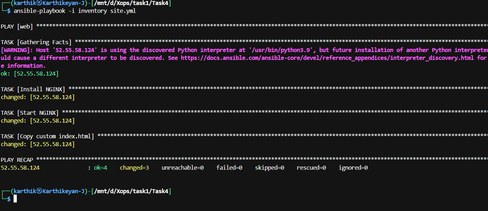
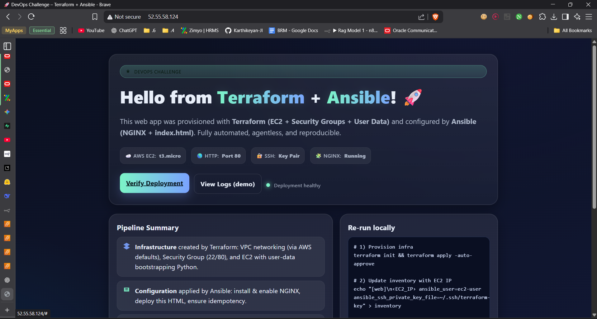

# 🚀 DevOps Challenge – Terraform + Ansible Deployment

This project demonstrates how to **provision infrastructure with Terraform** and then **configure & deploy a web application with Ansible** on an AWS EC2 instance.  
The deployed app serves a **beautiful static HTML page** automatically 🎉.

---

## 📂 Project Structure

```
Task4/
├── inventory          # Ansible inventory with EC2 instance IP
├── site.yml           # Ansible playbook to configure and deploy app
├── templates/
│   └── index.html     # Your web UI (deployed on EC2)
├── main.tf            # Terraform config to create EC2 instance & security groups
└── README.md          # Documentation
```

---

## 🛠 Prerequisites

- [Terraform](https://developer.hashicorp.com/terraform/downloads) (v1.5+ recommended)
- [Ansible](https://docs.ansible.com/ansible/latest/installation_guide/intro_installation.html)
- AWS Account + IAM user with `EC2FullAccess`
- SSH key pair (`terraform-key.pem`) to connect to EC2

---

## 🚀 Steps to Deploy

### 1️⃣ Initialize Terraform
```bash
terraform init
```

### 2️⃣ Provision Infrastructure
```bash
terraform apply -auto-approve
```
- This will create an **EC2 instance** and a **security group** (allowing HTTP + SSH).
- Terraform outputs the **public IP** of the instance.

### 3️⃣ Configure & Deploy with Ansible
```bash
ansible-playbook -i inventory site.yml
```
- Installs **Nginx**
- Copies your `index.html` to `/usr/share/nginx/html/`
- Starts the web server

### 4️⃣ Verify in Browser
Open in browser:

```
http://<your-ec2-public-ip>
```

You should see your **custom HTML page** 🎨.

---

## 🔄 Updating the Website

If you modify `index.html`:
```bash
ansible-playbook -i inventory site.yml
```

No need to re-run Terraform unless infra is changed.

---

## 🧹 Destroy Infrastructure
When finished, clean up AWS resources:
```bash
terraform destroy -auto-approve
```

---

## 📸 Demo Screenshot
Terraform EC2 Instance



Ansible Playbook Execution



Output Screenshot

---

## ✅ Features
- Automated EC2 provisioning via Terraform
- Configuration management with Ansible
- Static website hosting with Nginx
- Simple redeployment workflow

---

## 📌 Notes
- Make sure your `.pem` key file path in `inventory` is correct
- Security groups open `:22` for SSH and `:80` for HTTP

---
