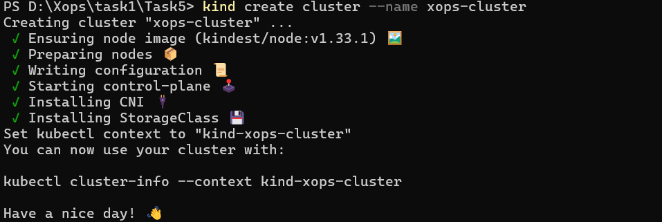
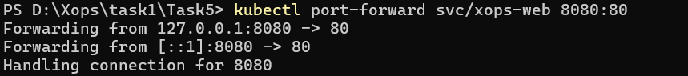
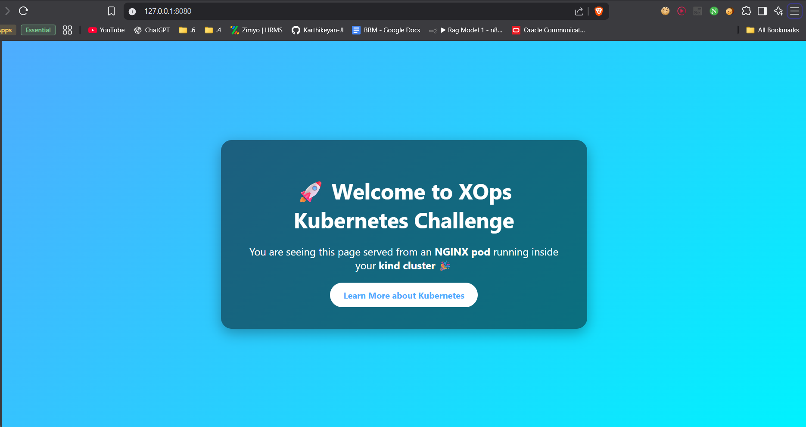

# 🚀 XOps Microchallenge #5 – Kubernetes with kind

## 📌 Objective
Learn Kubernetes fundamentals by setting up a local cluster with kind, deploying a sample app, and exploring control plane components.

---

## ⚙️ 1. Prerequisites
- Docker (with Linux engine enabled, not Windows containers)
- kind (Kubernetes-in-Docker)
- kubectl
- GitHub Account

Check installations:
```bash
docker --version
kind --version
kubectl version --client
```

---

## 🏗️ 2. Create a kind Cluster
```bash
kind create cluster --name xops-cluster
kubectl cluster-info
kubectl get nodes
```

---

## 🌐 3. Deploy a Custom Nginx App
We will use a ConfigMap to serve a custom `index.html` inside nginx.

### Steps:
1. Create `index.html` with custom design
2. Create ConfigMap:
   ```bash
   kubectl create configmap xops-html --from-file=index.html
   ```
3. Apply `app.yaml` (Deployment + Service)
4. Restart the pod:
   ```bash
   kubectl rollout restart deployment xops-web
   ```
5. Access app:
   ```bash
   kubectl port-forward svc/xops-web 8080:80
   ```
   👉 Visit: [http://localhost:8080](http://localhost:8080)

---

## 🔍 4. Explore Kubernetes Core Components

Useful commands:
```bash
kubectl get pods -A
kubectl get nodes
kubectl get componentstatuses
kubectl describe node
```

### Core Components
- **API Server** → Entry point for all kubectl/cluster requests
- **etcd** → Key-value store for cluster state
- **Controller Manager** → Ensures desired vs actual state
- **Scheduler** → Places pods onto nodes
- **kubelet** → Agent on nodes that manages pods
- **kube-proxy** → Handles networking and service routing

---

## 🧹 5. Clean Up
```bash
kind delete cluster --name xops-cluster
```

---

## 📂 Repo Structure
```
/kubernetes-xops-basics
├── README.md        # Setup steps, explanations
├── screenshots/     # Proof of deployment, kubectl outputs
├── app.yaml         # Declarative deployment manifest
├── index.html       # Custom Nginx homepage
```
## 📸 Demo Screenshot

Creating a kind cluster


Run in local host


Output
