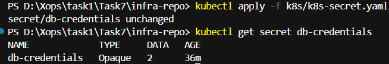
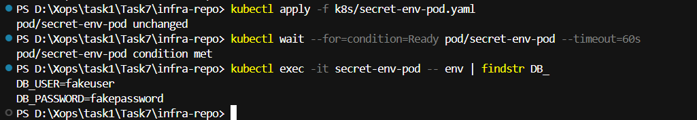
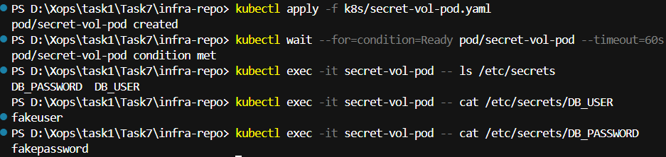

# XOps Microchallenge #7 — Kubernetes Secrets

## Included files
- `k8s-secret.yaml` — Secret manifest
- `secret-env-pod.yaml` — Pod with secret as env vars
- `secret-vol-pod.yaml` — Pod with secret mounted as files
- `README.md` 

# Environment Variables vs Mounted Files in Kubernetes Secrets

## Environment Variables:

- Best for small, simple values (like DB usernames or passwords).

- Easy for applications to consume.

- But risky because values can appear in logs, crash dumps, or debugging sessions.

- Secret values are only loaded when the pod starts — updating the Secret does not automatically update running pods.

## Mounted Files:

- Secrets are written as files inside the container (e.g., /etc/secrets/DB_USER).

- Useful for certificates, keys, or larger configuration values.

- Kubernetes can update the files automatically if the Secret changes (no pod restart needed).

- Slightly more work for the app, since it must read from files instead of env vars.

## 👉 Rule of thumb:
- Use env vars for simple app configs, and mounted files for sensitive or larger data like TLS certs/keys.

# 🛠️ Step-by-Step Execution

1. **Apply the Secret**
```powershell
kubectl apply -f k8s/k8s-secret.yaml
kubectl get secret db-credentials
```
---

---
2. ***Apply env pod and check env vars***
```powershell
kubectl apply -f k8s/secret-env-pod.yaml
kubectl wait --for=condition=Ready pod/secret-env-pod --timeout=60s
kubectl exec -it secret-env-pod -- env | findstr DB_
```
---

---
3. ***Apply volume pod and check files***
```powershell
kubectl apply -f k8s/secret-vol-pod.yaml
kubectl wait --for=condition=Ready pod/secret-vol-pod --timeout=60s
kubectl exec -it secret-vol-pod -- ls /etc/secrets
kubectl exec -it secret-vol-pod -- cat /etc/secrets/DB_USER
kubectl exec -it secret-vol-pod -- cat /etc/secrets/DB_PASSWORD
```
---

---